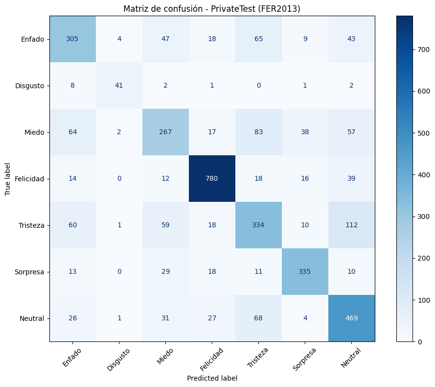

<div align="center">
  
</div>

<h1 align="center">Práctica 5</h1>

<div align="center" style="font-family: 'Segoe UI', sans-serif; line-height: 1.6; margin-top: 30px;">
  <h2 style="font-size: 28px; margin-bottom: 10px;">
    Asignatura: <span>Visión por Computador</span>
  </h2>
  <p style="font-size: 18px; margin: 4px 0;">
    Grado en Ingeniería Informática
  </p>
  <p style="font-size: 18px; margin-top: 10px;">
    Curso <strong>2025 / 2026</strong>
  </p>
</div>

<h2 align="center">Autores</h2>

- Asmae Ez Zaim Driouch
- Javier Castilla Moreno

<h2 align="center">Bibliotecas utilizadas</h2>


[](https://www.python.org/)
[](https://pytorch.org/)
[](https://pytorch.org/vision/stable/)
[](https://numpy.org/)
[](https://matplotlib.org/)
[](https://opencv.org/)
[](https://pillow.readthedocs.io/)
[](https://developers.google.com/mediapipe)
[](https://docs.python.org/3/library/collections.html#collections.deque)
[](https://docs.python.org/3/library/time.html)
[](https://docs.python.org/3/library/math.html)

## Cómo usar
### Primer paso: clonar este repositorio
```bash
git clone "https://github.com/Javier-Castilla/VC-P5"
```
### Segundo paso: Activar tu environment e instalar dependencias
> [!NOTE]
> Todas las dependencias pueden verse en [este archivo](environment.yml). Si se desea, puede crearse un entorno de Conda con dicho archivo.

Este environment es si cuenta con **GPU**. Por ello necesita tener instalado CUDA. Para ello puede ejcutar el siguiente comando:

```bash
conda install pytorch==1.12.1 torchvision==0.13.1 torchaudio==0.12.1 cudatoolkit=11.6 -c pytorch -c conda-forge
```

Ahora sí se procede a la creación del entorno empleando el environment a partir del archivo expuesto, es necesario abrir el `Anaconda Prompt` y ejecutar lo siguiente:

```bash
conda env create -f environment.yml
```

Posteriormente, se activa el entorno:

```bash
conda activate VC_P5
```


### Tercer paso: ejecutar el cuaderno
Finalmente, abriendo nuestro IDE favorito y teniendo instalado todo lo necesario para poder ejecutar notebooks, se puede ejecutar los cuadernos de la práctica [Practica_5.ipynb](P4/practica_5.ipynb) seleccionando el environment anteriormente creado.

> [!IMPORTANT]
> Todos los bloques de código deben ejecutarse en orden, de lo contrario, podría ocasionar problemas durante la ejecución del cuaderno.

<h1 align="center">Tareas Práctica 5</h1>

<h2 align="center">Entrenamiento del modelo</h2>

En esta sección se detalla el proceso completo seguido para entrenar el modelo de reconocimiento de emociones faciales a partir de imágenes. Se describe el dataset empleado, el preprocesado aplicado, las distintas arquitecturas evaluadas, los hiperparámetros de entrenamiento, así como los resultados y posibles mejoras.

---

### Dataset FER2013

El conjunto de datos utilizado es **FER2013**, disponible públicamente en Kaggle. Este dataset contiene aproximadamente 30.000 imágenes de rostros humanos en escala de grises con resolución de 48×48 píxeles, anotadas en 7 clases de emoción:

- Enfado
- Disgusto
- Miedo
- Felicidad
- Tristeza
- Sorpresa
- Neutral

Las imágenes se encuentran almacenadas en un archivo `.csv`, donde cada fila contiene:
- Una columna con la etiqueta de la emoción (entero de 0 a 6).
- Una columna con todos los píxeles de la imagen codificados como una cadena de texto, con valores separados por espacios.
- Una columna `Usage` que indica si la muestra pertenece a entrenamiento, validación (PublicTest) o test (PrivateTest).

A nivel de distribución, el dataset está particionado aproximadamente en un 70% para entrenamiento (28.709 imágenes) y el resto dividido entre validación y test. Además, el dataset presenta **desbalance de clases**, con mayor número de muestras en emociones como “Felicidad”, “Tristeza” y “Neutral”, lo que puede provocar que el modelo aprenda peor las clases minoritarias (por ejemplo “Disgusto”).

---

### Preprocesado y clase Dataset personalizada

Para integrar FER2013 en el pipeline de PyTorch se ha definido una clase `Dataset` personalizada que:

1. Lee el fichero `.csv` con la librería de manejo de datos.
2. Filtra las filas según el tipo de partición (`Usage` = "Training", "PublicTest" o "PrivateTest").
3. Convierte la cadena de píxeles en un vector numérico, lo reordena a una matriz 48×48 y lo castea a tipo entero de 8 bits.
4. Replica el canal de grises a 3 canales para adaptarse a modelos preentrenados en ImageNet (que esperan entrada RGB).
5. Aplica las transformaciones de `torchvision` (resize, conversión a tensor, normalización, etc.).
6. Devuelve un par `(imagen_transformada, etiqueta)`.

Se muestra a continuación el código de la clase desarrollada para el dataset:

```python
class FER2013RGB(Dataset):
  def __init__(self, csv_path, usage="Training", transform=None):
        self.data = pd.read_csv(csv_path)
        self.data = self.data[self.data['Usage'] == usage].reset_index(drop=True)
        self.transform = transform
    
  def __len__(self):
      return len(self.data)
    
  def __getitem__(self, idx):
      pixels = np.array(list(map(int, self.data.loc[idx, 'pixels'].split())))
      pixels = pixels.reshape(48, 48).astype(np.uint8)
      pixels = np.stack([pixels]*3, axis=-1)
      label = int(self.data.loc[idx, 'emotion'])
        
      if self.transform:
        pixels = self.transform(pixels)
        
      return pixels, labe
```

A nivel de transformaciones, se aplica típicamente:
- Redimensionado a 224×224 píxeles.
- Conversión a tensor.
- Normalización usando la media y desviación estándar de los canales de ImageNet.

Para mejorar la capacidad de generalización del modelo y reducir el sobreajuste, se ha implementado un pipeline diferenciado de transformaciones según la fase:

**Transformaciones de entrenamiento (con data augmentation):**
- `RandomHorizontalFlip(p=0.5)`: flip horizontal con 50% de probabilidad, aprovechando la simetría de las expresiones faciales.
- `RandomRotation(15)`: rotaciones aleatorias de ±15° para simular variaciones naturales de inclinación de cabeza.
- `RandomResizedCrop(224, scale=(0.8, 1.0))`: crop y zoom aleatorio entre 80-100%, forzando robustez ante variaciones de escala y encuadre.
- `ColorJitter(brightness=0.2, contrast=0.2, saturation=0.2)`: variaciones de brillo, contraste y saturación (±20%) para simular diferentes condiciones de iluminación.
- `RandomAffine(degrees=0, translate=(0.1, 0.1))`: traslaciones aleatorias de hasta ±10% en ambos ejes.

**Transformaciones de validación/test (sin augmentation):**
- Solo se aplica `Resize(224, 224)` directo, sin alteraciones aleatorias, para evaluar el rendimiento real del modelo sobre datos sin distorsionar.

Esta estrategia permite que durante el entrenamiento el modelo vea versiones diversas de cada imagen en cada época (actuando como regularización implícita), mientras que en evaluación se mide el rendimiento sobre imágenes sin modificaciones artificiales.

---

### Enfoques de arquitectura y experimentos

Para abordar el problema de clasificación de emociones se han probado tres enfoques principales, aumentando progresivamente la complejidad y la capacidad del modelo:

#### 1. CNN propia (baseline)

Como punto de partida se implementó una red convolucional sencilla, diseñada específicamente para este problema. La arquitectura consistía en varias capas convolucionales con activaciones ReLU y capas de pooling, seguidas de una capa densa para la clasificación final.

Este modelo permitió:
- Tener una referencia (baseline) de rendimiento sin usar modelos preentrenados.
- Comprobar rápidamente que el problema es suficientemente complejo como para beneficiarse del aprendizaje por transferencia.

El rendimiento obtenido fue de aproximadamente un 40% de precisión en el conjunto de validación/test, lo que indica que la capacidad del modelo y/o el tiempo de entrenamiento no eran suficientes.

---

#### 2. Transfer Learning con ResNet18 (congelando el backbone)

En un segundo experimento se optó por utilizar una **ResNet18** preentrenada en ImageNet. Esta red ha aprendido previamente a extraer características generales sobre millones de imágenes, lo que se puede aprovechar como extractor de rasgos para FER2013.

La estrategia seguida fue:
- Cargar ResNet18 preentrenada.
- **Congelar** todos los parámetros de la red (no se actualizan durante el entrenamiento).
- Sustituir únicamente la **capa totalmente conectada final** (`fc`) por una cabeza adaptada al problema de 7 clases.

La nueva cabeza definía la siguiente secuencia de capas:

- `Dropout(0.5)`
- `Linear(512, 256)`
- `ReLU`
- `Dropout(0.4)`
- `Linear(256, 7)`

Este diseño introduce regularización mediante dropout y una capa intermedia que permite aprender una representación más compacta antes de la clasificación final.

Ejemplo de cómo se redefine la cabeza del modelo:

```python
model = models.resnet18(weights=models.ResNet18_Weights.IMAGENET1K_V1)

for param in model.parameters():
    param.requires_grad = True

model.fc = nn.Sequential(
    nn.Dropout(0.5),
    nn.Linear(model.fc.in_features, 256),
    nn.ReLU(),
    nn.Dropout(0.4),
    nn.Linear(256, 7)
)
```

Con este enfoque, el modelo logró mejorar la precisión hasta alrededor de un 60%.  
Sin embargo, al mantener congelado el backbone, la capacidad de adaptación al dominio específico (caras 48×48 en escala de grises) es limitada, ya que solo la última capa aprende directamente del nuevo dataset.

---

#### 3. Fine Tuning completo de ResNet18 (modelo final elegido)

La tercera y última aproximación consiste en aplicar **Fine Tuning** a toda la ResNet18, permitiendo que tanto el backbone como la cabeza se adapten a FER2013:

- Se parte de la misma ResNet18 preentrenada en ImageNet.
- Se sustituye la capa final por la misma cabeza personalizada usada anteriormente.
- En este caso, **no se congelan los pesos** del backbone, de forma que todas las capas son entrenables.

Con este enfoque el modelo pudo “adaptar” todos sus filtros a las características concretas de FER2013, lo que se refleja en una mejora notable del rendimiento:

- `Train Acc` crece de forma progresiva hasta valores superiores al 90%.
- `Val Acc` alcanza un máximo de aproximadamente 70,5% antes de empezar a estancarse.

Por tanto, este es el modelo escogido como versión final para el prototipo.

---

### Configuración de entrenamiento

Para entrenar el modelo (tanto en el enfoque de Transfer Learning como en Fine Tuning) se utilizó la siguiente configuración típica:

- **Optimizador**: Adam (aunque se podría usar SGD con momentum), con:
  - `learning_rate = 1e-4` (valor típico para fine tuning).
  - `weight_decay` opcional para regularización L2.
- **Batch size**: 64 imágenes por batch.
- **Número máximo de épocas**: 50.
- **Scheduler de learning rate**: se empleó un planificador que reduce el `learning_rate` cuando la métrica de validación deja de mejorar durante cierto número de épocas.
- **Dispositivo**: entrenamiento en GPU (`cuda`) cuando estaba disponible.

Aquí puedes incluir el fragmento donde se definen optimizador y scheduler:

```python
criterion = nn.CrossEntropyLoss()
optimizer = optim.AdamW(model.parameters(), lr=LEARNING_RATE, weight_decay=WEIGHT_DECAY)
scheduler = optim.lr_scheduler.ReduceLROnPlateau(optimizer, mode='max', factor=0.5, patience=5, verbose=True)
```

---

### Early Stopping y selección del mejor modelo

Para evitar sobreajuste y reducir tiempo de entrenamiento se aplicó una estrategia de **Early Stopping** basada en la precisión de validación (`Val Acc`):

- Se monitoriza en cada época la `Val Acc`.
- Si la métrica no mejora más allá de un umbral mínimo (`min_delta`) durante un número consecutivo de épocas (`patience`), se detiene el entrenamiento.
- Cada vez que la `Val Acc` mejora, se guarda el mejor modelo en disco.

Se muestra la clase desarrollada para **Early Stopping**:

```python
class EarlyStopping:
  def __init__(self, patience=10, min_delta=0.001):
      self.patience = patience
      self.min_delta = min_delta
      self.counter = 0
      self.best_acc = 0
      self.early_stop = False
    
  def __call__(self, val_acc):
      if val_acc > self.best_acc + self.min_delta:
          self.best_acc = val_acc
          self.counter = 0
          return True 
      else:
          self.counter += 1
          if self.counter >= self.patience:
            self.early_stop = True
          return False
```

En los logs de entrenamiento se observa que el Early Stopping se activa alrededor de la época 44, con una precisión máxima de validación cercana a 0.705. Esta es la versión del modelo que se utiliza posteriormente en el prototipo.

---

### Comparación de enfoques

La siguiente tabla resume los resultados de los tres enfoques evaluados:

| Enfoque                        | Arquitectura base | Capas entrenadas        | Precisión aprox. validación |
|--------------------------------|-------------------|-------------------------|-----------------------------|
| CNN propia (baseline)          | CNN simple        | Todas                   | ~40 %                       |
| Transfer Learning ResNet18     | ResNet18          | Solo capa final         | ~60 %                       |
| Fine Tuning ResNet18 (final)   | ResNet18          | Toda la red + cabeza    | ~70 %                       |

Esta comparación muestra claramente la ventaja de utilizar modelos preentrenados combinados con fine tuning completo frente a una red diseñada desde cero.

A continuación, se muestra la gráfica generada a partir del entrenamiento con Fine Tuning:

<div align="center">

</div>

Seguidamente, la matriz de confusión a partir de la inferencia del modelo sobre el conjunto de validación:

<div align="center">

</div>

---

### Ejemplo de uso del modelo entrenado (inferencias)

Finalmente, una vez entrenado y guardado el modelo, puede cargarse y utilizarse para realizar inferencias sobre nuevas imágenes de rostros:

```python
model = models.resnet18(weights=None)
model.fc = torch.nn.Sequential(
    torch.nn.Dropout(0.5),
    torch.nn.Linear(512, 256),
    torch.nn.ReLU(),
    torch.nn.Dropout(0.4),
    torch.nn.Linear(256, 7)
)

model.load_state_dict(torch.load('best_resnet18_finetuned.pth', map_location=device))
model.eval()
model.to(device)

face_img = frame[y:y+h, x:x+w]
face_rgb = cv2.cvtColor(face_img, cv2.COLOR_BGR2RGB)
face_pil = Image.fromarray(face_rgb)
face_tensor = preprocess(face_pil).unsqueeze(0).to(device)
        
with torch.no_grad():
  outputs = model(face_tensor)
  probas = torch.softmax(outputs, dim=1)
  pred_idx = probas.argmax(dim=1).item()
  confidence = probas[0, pred_idx].item()
        
emotion = EMOTIONS[pred_idx]
```

Este pipeline se integra posteriormente en el prototipo (por ejemplo, sobre frames de una webcam o desde imágenes almacenadas) para realizar la detección y clasificación de emociones en tiempo (casi) real.


<h2 align="center">Prototipo 1: Detector de Emociones</h2>

<h2 align="center">Prototipo 2: Métricas de Atención</h2>

Este prototipo implementa un sistema de monitorización de atención en tiempo real mediante el análisis de características faciales. Se utiliza **MediaPipe Face Mesh**, una solución de Google basada en redes neuronales que detecta 468 puntos de referencia (landmarks) del rostro de forma precisa y eficiente, permitiendo el procesamiento en tiempo real incluso en hardware modesto.

**¿Por qué MediaPipe?**
- Rápido y ligero: procesamiento en tiempo real (30+ FPS) en CPU.
- Preciso: 468 landmarks 3D del rostro con alta resolución.
- Multiplataforma y gratuito: compatible con Python.
- Ventaja frente a alternativas: más rápido que dlib, más preciso que Haar Cascades de OpenCV.

---

### Métricas proporcionadas

El sistema proporciona las siguientes métricas al finalizar cada sesión de monitorización:

- **Número total de parpadeos detectados**: contador acumulativo de cierres de ojo completos.
- **Frecuencia de parpadeo**: parpadeos por minuto (BPM), útil para detectar fatiga visual.
- **Porcentaje de atención promedio**: proporción del tiempo que el usuario ha estado mirando a la cámara respecto al tiempo total de sesión.

Estas métricas se actualizan en tiempo real y se muestran en un panel visual superpuesto al feed de la cámara.

---

### Técnicas de detección implementadas

#### Eye Aspect Ratio (EAR)

El **EAR** (Eye Aspect Ratio) es una métrica geométrica que relaciona las distancias verticales y horizontales del ojo para detectar parpadeos. Cuando el ojo está abierto, el EAR tiene un valor cercano a 0.3; cuando se cierra durante un parpadeo, el EAR cae bruscamente por debajo de **0.25** (umbral empírico estándar).

**Cálculo:**
- Se utilizan 6 landmarks específicos del contorno de cada ojo.
- Distancias verticales: P2-P6 (A) y P3-P5 (B).
- Distancia horizontal: P1-P4 (C).
- Fórmula: **EAR = (A + B) / (2.0 × C)**

Cuando el EAR de ambos ojos cae por debajo del umbral durante varios frames consecutivos y luego se recupera, se registra un parpadeo.

Implementación:

```python
def calculate_eye_aspect_ratio(landmarks, eye_indices):
    A = np.linalg.norm(landmarks[eye_indices[1]] - landmarks[eye_indices[5]])
    B = np.linalg.norm(landmarks[eye_indices[2]] - landmarks[eye_indices[4]])
    C = np.linalg.norm(landmarks[eye_indices[0]] - landmarks[eye_indices[3]])
    ear = (A + B) / (2.0 * C)
    return ear
```

---

#### Detección de orientación horizontal (mirada a cámara)

Para determinar si el usuario está mirando directamente a la cámara, se compara la posición horizontal de la **punta de la nariz** (landmark 1) con el punto medio entre ambos ojos (landmarks 33 y 263, correspondientes a los cantos internos de los ojos).

**Criterio:**
- Se calcula la desviación horizontal absoluta entre nariz y centro inter-ocular.
- Si la desviación es menor a **0.03** (en coordenadas normalizadas de MediaPipe, donde la imagen va de 0.0 a 1.0), se considera que el usuario está mirando frontalmente.
- Este umbral empírico permite cierta tolerancia ante pequeños movimientos naturales de cabeza manteniendo precisión.

Implementación de dicha función:

```python
def is_looking_at_camera(landmarks):
    nose_tip = landmarks[1]          # Punta de la nariz
    left_eye = landmarks[33]         # Canto interno ojo izquierdo
    right_eye = landmarks[263]       # Canto interno ojo derecho
    eye_center = (left_eye + right_eye) / 2
    horizontal_deviation = abs(nose_tip[0] - eye_center[0])
    return horizontal_deviation < 0.03
```

---

### Seguimiento de métricas en tiempo real

Para acumular y calcular las estadísticas a lo largo de la sesión, se implementa una clase `AttentionMetrics` que mantiene el estado temporal:

```python
class AttentionMetrics:
    def __init__(self):
        self.blinks = 0                    # Contador de parpadeos
        self.total_time = 0                # Tiempo total transcurrido (s)
        self.attention_time = 0            # Tiempo mirando a cámara (s)
        self.start_time = time.time()     # Timestamp de inicio
        self.blink_history = deque(maxlen=100)  # Historial reciente
    
    def update(self, is_attentive, dt=1/30):
        """Actualiza métricas cada frame (asumiendo 30 FPS)"""
        self.total_time = time.time() - self.start_time
        if is_attentive:
            self.attention_time += dt
    
    def register_blink(self):
        """Registra un nuevo parpadeo detectado"""
        self.blinks += 1
        self.blink_history.append(time.time())
    
    def get_blinks_per_minute(self):
        """Calcula frecuencia de parpadeo en BPM"""
        if self.total_time > 0:
            return int((self.blinks / self.total_time) * 60)
        return 0
    
    def get_attention_percentage(self):
        """Calcula porcentaje de atención promedio"""
        if self.total_time > 0:
            return int((self.attention_time / self.total_time) * 100)
        return 0
```

---

### Dashboard visual en tiempo real

El sistema superpone un panel de información sobre el feed de la cámara, mostrando:

1. **Barra superior**: estado de atención (FOCUSED/DISTRACTED), porcentaje, barra de progreso.
2. **Indicadores laterales**: frecuencia de parpadeo, tiempo transcurrido.
3. **Panel derecho**: indicadores visuales de estado (mirando a cámara, contador de parpadeos).
4. **Tips dinámicos**: recomendaciones según métricas (ej: "Rest your eyes" si BPM > 30).

Implementación del dashboard:

```python
def draw_dashboard(frame, attention_percent, is_attentive, metrics):
    h, w = frame.shape[:2]
    
    # Barra superior semitransparente
    overlay = frame.copy()
    cv2.rectangle(overlay, (0, 0), (w, 150), (0, 0, 0), -1)
    cv2.addWeighted(overlay, 0.6, frame, 0.4, 0, frame)
    
    # Título
    cv2.putText(frame, "ATTENTION AND CONCENTRATION METER",
               (w//2 - 350, 35), cv2.FONT_HERSHEY_DUPLEX, 1.0, (0, 255, 255), 2)
    
    # Estado actual
    status_text = "FOCUSED" if is_attentive else "DISTRACTED"
    status_color = (0, 255, 0) if is_attentive else (0, 0, 255)
    cv2.putText(frame, f"Status: {status_text}",
               (20, 80), cv2.FONT_HERSHEY_SIMPLEX, 0.8, status_color, 2)
    
    # Porcentaje de atención
    cv2.putText(frame, f"Attention: {attention_percent}%",
               (20, 115), cv2.FONT_HERSHEY_SIMPLEX, 0.8, (255, 255, 255), 2)
    
    # Barra de progreso visual
    bar_width = int(300 * (attention_percent / 100))
    cv2.rectangle(frame, (300, 90), (600, 125), (100, 100, 100), -1)
    cv2.rectangle(frame, (300, 90), (300 + bar_width, 125), status_color, -1)
    cv2.rectangle(frame, (300, 90), (600, 125), (255, 255, 255), 2)
    
    # Frecuencia de parpadeo
    bpm = metrics.get_blinks_per_minute()
    cv2.putText(frame, f"Blinks/min: {bpm}",
               (650, 80), cv2.FONT_HERSHEY_SIMPLEX, 0.7, (255, 255, 255), 2)
    
    # Tiempo transcurrido
    minutes = int(metrics.total_time // 60)
    seconds = int(metrics.total_time % 60)
    cv2.putText(frame, f"Time: {minutes:02d}:{seconds:02d}",
               (w - 200, 80), cv2.FONT_HERSHEY_SIMPLEX, 0.7, (255, 255, 255), 2)
    
    # Panel lateral derecho
    cv2.rectangle(overlay, (w - 250, 150), (w, h), (0, 0, 0), -1)
    cv2.addWeighted(overlay, 0.6, frame, 0.4, 0, frame)
    
    y_offset = 200
    
    # Indicador de mirada
    looking = is_attentive
    look_color = (0, 255, 0) if looking else (0, 0, 255)
    cv2.circle(frame, (w - 220, y_offset), 15, look_color, -1)
    cv2.putText(frame, "Looking", (w - 190, y_offset + 5),
               cv2.FONT_HERSHEY_SIMPLEX, 0.6, (255, 255, 255), 1)
    
    y_offset += 60
    
    # Contador de parpadeos
    blink_color = (255, 255, 0)
    cv2.circle(frame, (w - 220, y_offset), 15, blink_color, -1)
    cv2.putText(frame, f"Blinks: {metrics.blinks}", (w - 190, y_offset + 5),
               cv2.FONT_HERSHEY_SIMPLEX, 0.6, (255, 255, 255), 1)
    
    # Tips dinámicos
    y_offset = h - 150
    cv2.putText(frame, "TIPS:", (w - 230, y_offset),
               cv2.FONT_HERSHEY_DUPLEX, 0.6, (0, 255, 255), 1)
    
    y_offset += 30
    if bpm > 30:
        cv2.putText(frame, "Rest your eyes", (w - 230, y_offset),
                   cv2.FONT_HERSHEY_SIMPLEX, 0.5, (255, 200, 100), 1)
    elif bpm < 10 and metrics.total_time > 60:
        cv2.putText(frame, "Blink more often", (w - 230, y_offset),
                   cv2.FONT_HERSHEY_SIMPLEX, 0.5, (255, 200, 100), 1)
```

---

### Limitaciones y posibles mejoras

**Limitaciones actuales:**
- **Iluminación**: el rendimiento puede degradarse con iluminación muy baja o contraluz intenso, afectando la detección de landmarks.
- **Múltiples personas**: actualmente procesa solo el rostro más prominente; podría extenderse a seguimiento multi-persona.
- **Calibración fija**: los umbrales (EAR < 0.25, desviación < 0.03) son estáticos y podrían no ser óptimos para todos los usuarios.

<h1 align="center">Bibliografía</h1>
